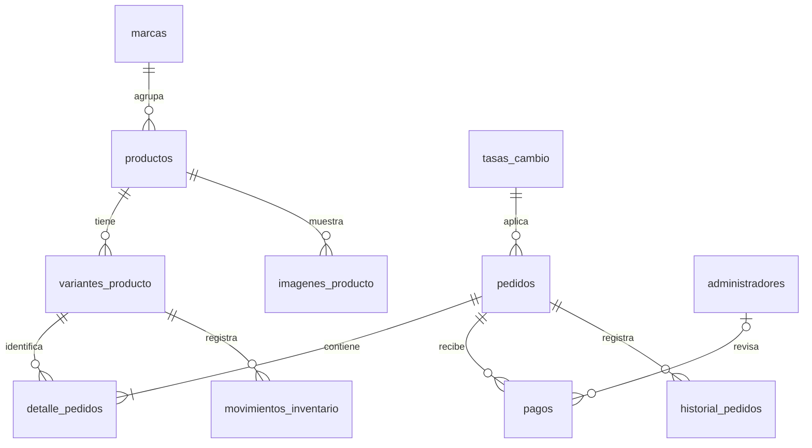

# Base de datos de Blue Fragancias

Esquema inicial para PostgreSQL 18. Las tablas y columnas estan en español (sin
acentos en los identificadores) para que podamos estudiar cada relacion.
No se crean administradores, contraseñas, productos ni tasas ficticias en la tienda.

## Instalacion

Si ya tienes una sesion de **psql** abierta como `postgres`, ejecuta:

```text
\i 'C:/Users/Moise/Documents/PROGRAMACION/Blue Fragancias/backend/database/instalar.sql'
```

Alternativamente, desde **CMD**, ejecuta este comando y escribe tu contraseña
localmente cuando se solicite (no la pongas en el comando ni en el repositorio):

```cmd
"C:\Program Files\PostgreSQL\18\bin\psql.exe" -X -W -h localhost -p 5432 -U postgres -d postgres -f "C:\Users\Moise\Documents\PROGRAMACION\Blue Fragancias\backend\database\instalar.sql"
```

El instalador crea `blue_fragancias` solamente si no existe, se conecta a ella y
ejecuta `001_esquema_inicial.sql` en una transaccion. No borra tablas existentes.
Si hay un error, no continua; la migracion se revierte. Si la base acaba de crearse,
puede quedar vacia para corregir el problema y volver a ejecutar el archivo.

**Esta migracion se aplica una sola vez.** Una segunda ejecucion falla al encontrar
las tablas existentes y conserva sus datos. Los cambios futuros llevaran archivos
numerados nuevos, sin borrar ni recrear la base.

Al terminar deben aparecer 11 tablas. Para volver a listarlas desde psql:

```text
\connect blue_fragancias
\dt public.*
```

Para estudiar una tabla y ver sus claves y restricciones:

```text
\d public.productos
\d public.variantes_producto
```

## Tablas

| Tabla | Responsabilidad |
|---|---|
| `administradores` | Acceso del personal; hash Argon2id, nunca contraseña en texto |
| `marcas` | Marcas de perfumes sin duplicados por mayusculas |
| `productos` | Datos compartidos del perfume y visibilidad en el catalogo |
| `variantes_producto` | SKU, presentacion, ml, concentracion, precio y stock |
| `imagenes_producto` | Archivos del producto, texto alternativo y orden |
| `tasas_cambio` | Historial EUR/VES con fuente, vigencia y origen manual/API |
| `pedidos` | Invitado, entrega, estado, tasa y totales aplicados |
| `detalle_pedidos` | Productos comprados, cantidades y precios historicos |
| `pagos` | Metodo, moneda real, importe, referencia y revision administrativa |
| `movimientos_inventario` | Entradas, reservas, liberaciones, ventas y devoluciones |
| `historial_pedidos` | Registro automatico de la creacion y cambios de estado |



## Reglas que ya protege el esquema

- **Precio:** referencia USD × tasa EUR/VES. Es la regla comercial acordada, no una
  conversion de divisas USD/VES. Los importes usan `NUMERIC`, no punto flotante.
- **Redondeo:** precios de referencia a dos decimales; tasa a seis. Total Bs =
  `round((subtotal_ref_usd + costo_entrega_ref_usd) * tasa_eur_ves, 2)`.
  Se redondea el total una vez. No sumar conversiones redondeadas por unidad.
- **Envio pendiente:** `costo_entrega_ref_usd = NULL` deja ambos totales en NULL.
  No se puede confirmar hasta cotizarlo. Pickup tiene costo cero explicito.
- **Tasa historica:** las tasas no se editan ni eliminan; una correccion crea otra
  fila. La FK compuesta exige que el valor del pedido coincida con su tasa.
- **Detalle historico:** nombre, SKU, presentacion y precio se copian al detalle.
  Una edicion del catalogo no modifica estos datos del pedido.
- **Totales coherentes:** una restriccion diferida comprueba al `COMMIT` que el
  subtotal sea igual a la suma del detalle. Cabecera y lineas se crean dentro de
  la misma transaccion; no se pueden guardar pedidos sin lineas.
- **Duplicados:** la API debera reutilizar la misma `clave_idempotencia` al reintentar
  una operacion. La base rechaza claves repetidas en pedidos, pagos y movimientos.
- **Pago:** empieza reportado; verificar o rechazar requiere administrador y fecha.
  Pago Movil usa VES y sus datos bancarios. Binance Pay conserva la moneda recibida
  (por ejemplo USDT); no equivale automaticamente a un importe USD. El efectivo
  permite USD, VES o EUR. Las referencias de Pago Movil se distinguen por bancos,
  telefono pagador y fecha, no mediante una unicidad global de su numero.
- **Historial:** las relaciones de ventas usan `RESTRICT`; no hay borrados en
  cascada que eliminen pagos o pedidos. Los productos se desactivan.

## Inventario y transacciones

Disponibilidad = `stock_fisico - stock_reservado`.

Crear las variantes con stock cero. Para cargar o cambiar existencias, **insertar
movimientos**. Su trigger modifica atomicamente el saldo de la variante; si una
restriccion falla, se revierte tanto el movimiento como su efecto en el stock.

| Operacion de una unidad | Cambio fisico | Cambio reservado |
|---|---:|---:|
| Entrada | +1 | 0 |
| Reserva | 0 | +1 |
| Liberacion | 0 | -1 |
| Venta de una unidad reservada | -1 | -1 |
| Devolucion de una unidad vendida | +1 | 0 |

Una reserva/venta/devolucion se vincula al detalle de su propio pedido. No puede
consumir reservas ajenas, exceder la cantidad comprada ni devolver mas de lo vendido.
Los movimientos son inmutables; las correcciones se registran con nuevos movimientos.

La API debera crear el pedido, sus lineas y sus reservas en **una transaccion**,
procesando variantes por `id` ascendente para reducir bloqueos cruzados. El
vencimiento de reservas todavia debe acordarse; `reserva_hasta` prepara ese dato,
pero no existe aun un proceso que libere las reservas vencidas automaticamente.

## Limites y siguientes pasos

Esto es el esquema, no una API ni un sistema de autenticacion completo. Antes de
conectar la tienda faltan:

1. Crear un rol de base de datos para el backend, sin privilegios de administrador,
   y conceder solo los permisos necesarios. No usar `postgres` en la aplicacion.
   Los saldos de variantes deben escribirse solo mediante movimientos, nunca con
   SQL de actualizacion directo enviado desde una ruta administrativa.
2. Implementar autenticacion, Argon2id, validacion, consultas parametrizadas y
   autorizacion. El prefijo del hash en la tabla no sustituye el hash real.
3. Calcular precios y copiar snapshots en el servidor; gestionar claves de
   idempotencia y transacciones. Tras confirmar, impedir ediciones comerciales
   arbitrarias del pedido/detalle; cualquier correccion debe tener trazabilidad.
4. Validar las transiciones de estados, definir expiracion/liberacion y añadir
   historial de revisiones de pago si se permite volver a cambiar una revision.
5. Seleccionar una fuente de tasas real. No esta conectada ninguna API ni se afirma
   que una API de terceros pertenezca al BCV. Elegir la tasa vigente para la fecha
   de Caracas, no una cotizacion futura publicada anticipadamente; acordar cuanto
   tiempo sigue siendo aceptable una tasa almacenada si la fuente falla.
6. Conciliar pagos parciales, monedas y efectivo contra el pedido sin sumar monedas
   distintas directamente. WhatsApp no confirma orden ni pago por si mismo.
7. Guardar comprobantes en almacenamiento privado. Un UUID de pedido no reemplaza
   un mecanismo de autorizacion para consultar datos personales.

## Pruebas reproducibles

**Verificado el 2026-09-25:** `pruebas.sql` fue reconstruido y la suite completa
terminó con código de salida 0 en PostgreSQL 18 temporal. Incluye 73 comprobaciones
SQL, más las verificaciones del ejecutor sobre instalación, reejecución,
subtotal al COMMIT y dos conexiones que disputan la última unidad.
BF-023 completado en [el tablero del proyecto](../../documentacion/seguimiento/TABLERO.md).

Desde la carpeta raiz del proyecto:

```cmd
node backend/database/test-schema.cjs
```

Usa los binarios locales de PostgreSQL 18 (ruta alternativa mediante `PG_BIN`).
Inicia un servidor desechable en un puerto libre de `127.0.0.1`, con usuario y
contraseña temporales, aplica el esquema y prueba los casos de negocio. Al terminar
lo detiene y elimina exclusivamente su directorio temporal. No se conecta al
servicio PostgreSQL habitual ni lee su contraseña.

Incluye una prueba con dos conexiones intentando reservar la ultima unidad, y
comprueba subtotales al commit, snapshots, costos pendientes, referencias repetidas,
revision de pagos, reservas ajenas y devoluciones invalidas. `pruebas.sql` contiene
datos ficticios exclusivamente para ese servidor; no se ejecuta al instalar la tienda.
El archivo verifica el usuario y la carpeta del servidor temporal, además de exigir
tablas vacías. Sus ayudantes comprueban resultados y códigos de error esperados;
cualquier fallo detiene la ejecución. La tasa de ejemplo es sintética y no debe
usarse como cotización. Los cinco pedidos de prueba se conservan hasta que el
ejecutor termina sus comprobaciones y elimina el servidor temporal.

Referencias: [restricciones](https://www.postgresql.org/docs/18/ddl-constraints.html),
[tipos numericos](https://www.postgresql.org/docs/18/datatype-numeric.html) y
[bloqueos](https://www.postgresql.org/docs/18/explicit-locking.html) de PostgreSQL.
