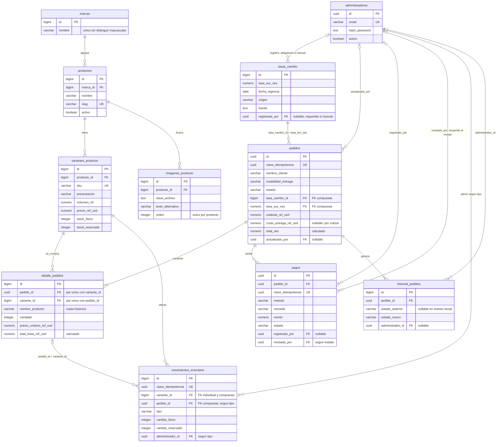

# Base de datos de Blue Fragancias

Este mapa explica las **11 tablas y sus 16 relaciones mediante claves foráneas**. Se basa en el [SQL real del proyecto](../backend/database/001_esquema_inicial.sql); documenta lo que ya existe en la base, no una propuesta de tablas futuras.

Abre el [diagrama visual en HTML](diagrama-base-datos.html) para explorar las relaciones o la [versión SVG](diagrama-base-datos.svg) para ampliar, imprimir y compartir. También tienes una [imagen PNG](diagrama-base-datos.png). El diagrama editable en Mermaid está al final de esta guía.

El HTML funciona localmente, sin conexión a internet ni a la base de datos. Puedes pulsar una tabla, elegirla en la lista o ampliar el gráfico para consultar sus campos y conexiones. El panel inferior representa referencias a administradores; no añade nuevas tablas.

Para regenerar el HTML y el SVG después de modificar la documentación, ejecuta desde la raíz del proyecto:

```cmd
node documentacion/generar-diagrama.cjs
```

El generador extrae los campos del SQL y verifica los nombres usados en las relaciones. Las descripciones, conexiones y posiciones se mantienen en el propio generador y deben actualizarse si cambia el modelo. La imagen PNG es una exportación del SVG y debe volver a exportarse si cambia el diagrama.

## Cómo leer el esquema

- **Tabla:** un conjunto de registros del mismo tipo; por ejemplo, perfumes.
- **Fila:** un registro; por ejemplo, un perfume concreto.
- **PK, clave primaria:** identifica una fila sin repetirse. En este esquema siempre se llama `id`.
- **FK, clave foránea:** conecta una fila con otra tabla y evita referencias inexistentes.
- **UNIQUE:** impide repetir un valor o una combinación de valores.
- **NOT NULL:** obliga a proporcionar un valor. Un campo que acepta `NULL` puede quedar sin dato, salvo que otra regla lo exija.
- **1 → muchos:** una marca puede tener varios productos, pero cada producto pertenece a una sola marca. Que permita varios no obliga a crearlos inmediatamente.
- **FK compuesta:** la relación compara dos campos juntos, no cada campo por separado.

En Mermaid, `||` significa exactamente uno, `o|` significa cero o uno, `o{` significa cero o muchos y `|{` significa uno o muchos.

## Qué hace cada tabla

| Tabla | Función y ejemplo | Campos principales |
|---|---|---|
| `administradores` | Personal autorizado para operar la tienda. No representa a los compradores. | `id`, `nombre`, `email`, `hash_password`, `activo` |
| `marcas` | Agrupa los perfumes por fabricante o marca. | `id`, `nombre` |
| `productos` | Describe el perfume, independientemente de su tamaño o presentación. | `id`, `marca_id`, `nombre`, `slug`, `descripcion`, `genero`, `familia_olfativa`, `activo` |
| `variantes_producto` | Cada presentación vendible: por ejemplo, el mismo perfume de 50 ml y 100 ml, con precios y existencias diferentes. | `id`, `producto_id`, `sku`, `presentacion`, `tipo_presentacion`, `concentracion`, `volumen_ml`, `precio_ref_usd`, `stock_fisico`, `stock_reservado` |
| `imagenes_producto` | Referencias a las fotos del perfume, con descripción accesible y orden. La foto no se guarda como imagen binaria aquí. | `id`, `producto_id`, `clave_archivo`, `texto_alternativo`, `orden` |
| `tasas_cambio` | Conserva cada tasa EUR/VES y su procedencia. Una corrección se registra como otra fila. | `id`, `tasa_eur_ves`, `fecha_vigencia`, `fuente`, `origen`, `consultada_en`, `registrada_por` |
| `pedidos` | Cabecera de la compra: datos del invitado, entrega, estado, tasa utilizada y totales. | `id`, `clave_idempotencia`, `nombre_cliente`, `telefono_cliente`, `modalidad_entrega`, `estado`, `tasa_cambio_id`, `tasa_eur_ves`, `subtotal_ref_usd`, `costo_entrega_ref_usd`, `total_ref_usd`, `total_ves`, `actualizado_por` |
| `detalle_pedidos` | Cada línea comprada: qué variante, cuántas unidades y a qué precio. Copia los datos comerciales del momento de compra. | `id`, `pedido_id`, `variante_id`, `sku`, `nombre_producto`, `presentacion`, `cantidad`, `precio_unitario_ref_usd`, `total_linea_ref_usd` |
| `pagos` | Operaciones de Pago Móvil, Binance Pay o efectivo asociadas a un pedido y su revisión. Un pedido puede tener varios pagos. | `id`, `pedido_id`, `clave_idempotencia`, `metodo`, `moneda`, `monto`, `referencia_operacion`, `estado`, `registrado_por`, `revisado_por`, `revisado_en`, `comprobante_clave_privada` |
| `movimientos_inventario` | Libro de entradas, ajustes, reservas, liberaciones, ventas y devoluciones. Cada movimiento aplica un cambio al stock. | `id`, `clave_idempotencia`, `variante_id`, `pedido_id`, `tipo`, `cambio_fisico`, `cambio_reservado`, `motivo`, `administrador_id` |
| `historial_pedidos` | Traza la creación y los cambios de estado de cada pedido. | `id`, `pedido_id`, `estado_anterior`, `estado_nuevo`, `administrador_id`, `creado_en` |

**Producto y variante son conceptos distintos.** El producto reúne nombre, marca y fotos; la variante tiene el SKU, los mililitros, el precio y el stock que se venden. Las fotos actuales pertenecen al producto, no a una variante particular.

## Todas las relaciones

Cada fila siguiente representa una FK del SQL. Una fila de la tabla de destino puede recibir muchas referencias; las condiciones indican si la fila que apunta a ella debe tenerla obligatoriamente.

| # | Tabla que apunta → tabla de destino | Campo o campos de la FK | Obligación y significado |
|---:|---|---|---|
| 1 | `productos` → `marcas` | `marca_id` → `id` | Obligatoria: cada perfume pertenece a una marca. |
| 2 | `variantes_producto` → `productos` | `producto_id` → `id` | Obligatoria: cada presentación pertenece a un perfume. |
| 3 | `imagenes_producto` → `productos` | `producto_id` → `id` | Obligatoria: cada imagen pertenece a un perfume. |
| 4 | `tasas_cambio` → `administradores` | `registrada_por` → `id` | Opcional para origen `api`; obligatoria para origen `manual`. |
| 5 | `pedidos` → `tasas_cambio` | **(`tasa_cambio_id`, `tasa_eur_ves`) → (`id`, `tasa_eur_ves`)** | Obligatoria y compuesta: identifica la tasa y exige que su valor coincida exactamente. |
| 6 | `pedidos` → `administradores` | `actualizado_por` → `id` | Opcional: permite un pedido creado por un invitado o un proceso. No se exige por cada estado. |
| 7 | `detalle_pedidos` → `pedidos` | `pedido_id` → `id` | Obligatoria: cada línea tiene un pedido. Al confirmar la transacción, el pedido debe tener líneas que sumen su subtotal positivo. |
| 8 | `detalle_pedidos` → `variantes_producto` | `variante_id` → `id` | Obligatoria: la compra es de una presentación concreta. |
| 9 | `pagos` → `pedidos` | `pedido_id` → `id` | Obligatoria: cada pago pertenece a un pedido; un pedido puede no tener pagos todavía. |
| 10 | `pagos` → `administradores` | `registrado_por` → `id` | Opcional: identifica al administrador que cargó el pago cuando corresponda. |
| 11 | `pagos` → `administradores` | `revisado_por` → `id` | Ausente en estado `reportado`; obligatorio junto con `revisado_en` en `verificado` o `rechazado`. Registrar y revisar son responsabilidades distintas, aunque puede ejercerlas la misma persona. |
| 12 | `movimientos_inventario` → `variantes_producto` | `variante_id` → `id` | Obligatoria: todo movimiento afecta una variante. |
| 13 | `movimientos_inventario` → `detalle_pedidos` | **(`pedido_id`, `variante_id`) → (`pedido_id`, `variante_id`)** | Opcional cuando `pedido_id` es `NULL`; obligatoria para `reserva`, `liberacion`, `venta` y `devolucion`. Exige que esa variante forme parte de ese pedido. |
| 14 | `movimientos_inventario` → `administradores` | `administrador_id` → `id` | Obligatoria para `entrada`, `ajuste` y `devolucion`; opcional para los demás tipos. |
| 15 | `historial_pedidos` → `pedidos` | `pedido_id` → `id` | Obligatoria: cada evento se refiere a un pedido. Un trigger crea el evento inicial y los cambios de estado. |
| 16 | `historial_pedidos` → `administradores` | `administrador_id` → `id` | Opcional: el trigger copia `pedidos.actualizado_por`, que puede ser `NULL`. |

**No existe una FK directa de `movimientos_inventario.pedido_id` a `pedidos.id`.** La relación pasa por el par pedido/variante de `detalle_pedidos`. Así el movimiento no puede señalar una variante ajena a ese pedido. Si `pedido_id` es `NULL`, la FK compuesta no exige un detalle; la FK individual de `variante_id` sí sigue vigente.

Todas las FK usan **`ON DELETE RESTRICT`**: no se puede borrar una fila que todavía tenga referencias. No hay eliminaciones en cascada que borren pedidos, pagos o movimientos al borrar un producto.

## Qué valores no pueden repetirse

Además del `id` de cada tabla, el esquema exige estas unicidades:

| Tabla | Valor o combinación única |
|---|---|
| `administradores` | `email`, almacenado en minúsculas y sin espacios exteriores. |
| `marcas` | `lower(nombre)`: las diferencias de mayúsculas no crean otra marca. |
| `productos` | `slug`, para identificar el producto en su dirección web. |
| `variantes_producto` | `sku`, almacenado en mayúsculas. |
| `imagenes_producto` | (`producto_id`, `orden`): dos fotos del mismo producto no ocupan la misma posición. |
| `tasas_cambio` | (`id`, `tasa_eur_ves`), utilizado como destino de la FK compuesta. La tasa numérica sí puede repetirse en distintos registros. |
| `pedidos` | `clave_idempotencia`. |
| `detalle_pedidos` | (`pedido_id`, `variante_id`): cada variante aparece una vez por pedido, con su cantidad. |
| `pagos` | `clave_idempotencia`; además, índices únicos parciales sobre operaciones de Binance Pay y Pago Móvil. |
| `movimientos_inventario` | `clave_idempotencia`. |

En Binance Pay no se repite `referencia_operacion` entre pagos no rechazados. En Pago Móvil no se repite la combinación de bancos de origen y destino, teléfono pagador, fecha y referencia entre pagos no rechazados. El esquema permite reutilizar una referencia de un pago rechazado.

La **idempotencia** sirve para gestionar reintentos: la API deberá reutilizar la misma clave para una misma operación. La base rechaza la repetición; todavía falta programar cómo devolver al cliente el resultado ya existente.

## Un recorrido de compra para entender las tablas

Este es el flujo que deberá implementar el backend:

1. Consultar `marcas`, `productos`, `variantes_producto` e `imagenes_producto` para mostrar el catálogo.
2. Leer una tasa válida de `tasas_cambio`. La conexión con una fuente externa todavía no está implementada.
3. Crear `pedidos` con los datos del invitado y copiar cada compra a `detalle_pedidos`. **No hay tabla de clientes ni inicio de sesión del comprador**: sus datos se guardan en cada pedido.
4. Insertar los movimientos de reserva que correspondan en `movimientos_inventario`. La creación del pedido, sus líneas y sus reservas deberá realizarse en una misma transacción.
5. Preparar el enlace a WhatsApp con el pedido ya guardado. Abrir WhatsApp o enviar el mensaje **no confirma ni paga el pedido**.
6. Registrar una operación en `pagos`; el personal revisa su recepción y deja constancia de quién la verificó o rechazó.
7. Actualizar el pedido y realizar los movimientos de inventario apropiados. `historial_pedidos` registra automáticamente los cambios de estado, pero **cambiar el estado del pedido no crea por sí mismo una reserva, venta ni pago**.

### Precios y entrega

La regla comercial acordada es **referencia USD × tasa EUR/VES**. No representa una conversión cambiaria USD/VES.

```text
total_linea_ref_usd = cantidad × precio_unitario_ref_usd
subtotal_ref_usd    = suma de los totales de las líneas
total_ref_usd       = subtotal_ref_usd + costo_entrega_ref_usd
total_ves           = redondear(total_ref_usd × tasa_eur_ves, 2 decimales)
```

Los totales de línea, total de referencia y total en bolívares son columnas calculadas por PostgreSQL. Un trigger comprueba al `COMMIT` que el subtotal coincida con el detalle. Los importes usan `NUMERIC` para trabajar con decimales exactos.

- **Pickup:** costo de entrega obligatorio e igual a `0`.
- **Delivery y envío nacional:** requieren dirección; el costo puede ser `NULL` mientras el pedido esté pendiente de confirmación o cancelado. `NULL` significa “por cotizar”, no “gratis”. Mientras sea `NULL`, ambos totales también son `NULL`.
- La tasa usada queda vinculada a su registro histórico y no cambia al añadir otra tasa.
- El detalle conserva copias del nombre, SKU, presentación y precio: editar el catálogo no cambia esas copias. Aún debe impedirse en la API modificar arbitrariamente un pedido confirmado.
- El pago conserva la moneda realmente recibida. USD, EUR y USDT no se suman entre sí sin una regla de conciliación.

### Inventario

```text
disponible = stock_fisico - stock_reservado
```

| Movimiento de una unidad | Cambio físico | Cambio reservado |
|---|---:|---:|
| Entrada | +1 | 0 |
| Reserva | 0 | +1 |
| Liberación | 0 | -1 |
| Venta de una unidad reservada | -1 | -1 |
| Devolución | +1 | 0 |

El tipo `ajuste` permite aumentar o disminuir el físico con motivo y administrador. Las variantes deben comenzar con stock cero y recibir existencias mediante movimientos. El trigger aplica ambos cambios de forma atómica y las restricciones impiden stock negativo o reservado mayor que el físico. También valida las cantidades ligadas al detalle del propio pedido. **No se debe actualizar el saldo directamente** desde la aplicación.

## Protección existente y trabajo pendiente

| Ya definido en la base | Aún debe implementarse en la aplicación y operación |
|---|---|
| PK, FK, unicidad, límites de cantidades, coherencia de importes y varios datos requeridos. | Validación completa de solicitudes, consultas parametrizadas y manejo de errores. |
| Campo para hash de contraseña con prefijo Argon2id. | Generar y verificar hashes reales; el prefijo por sí solo no prueba su validez. Añadir sesiones seguras y permisos administrativos. |
| Tasas, movimientos e historial bloquean `UPDATE`/`DELETE` mediante triggers. | Rol de base de datos con permisos limitados: la aplicación no debe conectarse como `postgres` ni poder modificar stock por fuera de movimientos. |
| Identificación del administrador en revisiones de pago y operaciones de inventario determinadas. | Autorizar al administrador autenticado en cada operación; historial adicional si se permiten nuevas revisiones de un pago. |
| Estados permitidos y algunas combinaciones coherentes de entrega. | Validar transiciones entre estados y conciliar pagos contra el pedido. |
| Campo `reserva_hasta`. | Definir plazos y ejecutar la liberación de reservas vencidas; guardar la fecha no programa esa tarea. |
| Campo para clave privada del comprobante. | Almacenamiento privado, control de acceso y validación de archivos. Un UUID de pedido no autoriza a consultar datos personales. |
| Historial de tasa con origen, fuente y vigencia. | Seleccionar una fuente fiable, comprobar vigencia y manejar fallos de consulta. |

La API, el frontend, WhatsApp, los pagos y los servicios externos todavía necesitan su implementación. Este esquema es su base de datos; no implica que esos flujos ya estén funcionando.

## Diagrama Mermaid editable

El diagrama incluye las 11 tablas y las 16 FK. Los campos mostrados son una selección para facilitar la lectura; el SQL enlazado al inicio contiene todas las columnas y restricciones. Las dos relaciones de `pagos` con `administradores` son independientes.



La cardinalidad mínima de las líneas del pedido depende de la comprobación del subtotal al `COMMIT`; la del historial se cumple por el trigger de creación. Las relaciones opcionales del dibujo se vuelven obligatorias en los casos explicados en la matriz.
